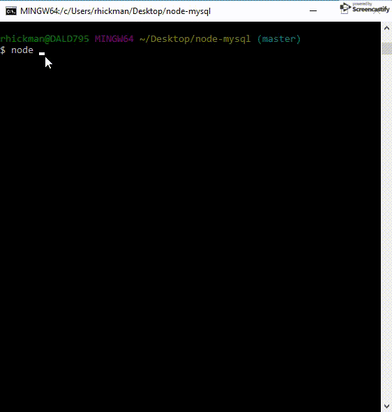

# Bamazon (node-mysql)
Bamazon is an Amazon-like storefront CLI application created using `Node.js`, `MySQL` & `inquirer` NPM. Output is styled with `Chalk` and `tty-table` NPM's. This app takes in customer orders, calculates the sales price, and depletes stock from the store's Inventory. 

`.gitignore` is used to hide database username and password which are stored locally and kept safe through abstraction with `.env`, requiring users to provide their own MySQL username and password if they intend to use the app. 

### Deployment
1. Run `npm install`
2. Build database from `bamazon_db.sql`
3. At command prompt run `node bamazonCustomer.js` for Customer View or `node bamazonManager.js` for Manager View. Explanation of each view found below.

#### Customer View 
Running the `node bamazonCustomer.js` command displays all items available for sale displaying the `ID`, `Product Name`, `Price` and `Stock` amount for each product. It then prompts the user with two messages. First asking for the ID of the product they would like to buy and then asking for the quantity. Once the user inputs are receieved, the application checks to see if the store has enough of the product to meet the customer's request. If the store does NOT have enough of the product, the order is prevented from going through and a phrase is logged `Insufficient quantity please try again` along with the current amount of available stock for that product. If the store has enough of the product requested, the customer's order is fulfilled and a receipt is displayed showing the `Product Name`, `Quantity` and `Total Cost` with a phrase saying `Purchase Successful!`. The stock inventory of the purchased product is then updated in the database to reflect the new available amount of that product. The user is then asked if they would like to make another purchase. If yes, the process restarts and if no, the connection to the application ends.

#### Manager View
Running the `node bamazonManager.js` command lists a set of menu options. 
1. `View Products for Sale` 
    * If `View Products for Sale` is selected, the app lists every available item showing their `ID`, `Product Name`, `Price` and `Stock` amount.
2. `View Low Inventory`
    * If `View Low Inventory` is selected, the app lists all items with an inventory count lower than five.
3. `Add to Inventory` 
    * If `Add to Inventory` is selected, the app displays a prompt that lets the user add more of any item currently in the store.
4. `Add New Product` 
    * If `Add New Product` is selected, the app allows the user to add a completely new product to the store.

### Technology/Dependencies 
* JavaScript: https://www.javascript.com/
* Node.js: https://nodejs.org/en/
* MySQL Server: https://dev.mysql.com/downloads/mysql
* MySQL Workbench: https://dev.mysql.com/downloads/workbench/
* mysql: https://www.npmjs.com/package/mysql
* DotEnv: https://www.npmjs.com/package/dotenv
* Inquirer: https://www.npmjs.com/package/inquirer
* tty-table: https://www.npmjs.com/package/tty-table
* Chalk: https://www.npmjs.com/package/chalk
